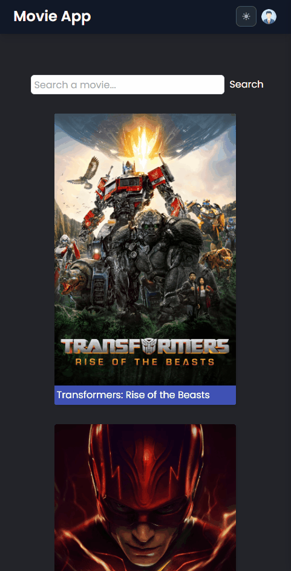

# Blog App
## Live Link: https://movie-app-react-fay.netlify.app/
## Description
Welcome to the Movie App! This project provides a user-friendly platform for movie enthusiasts to explore and discover various movies. With a sleek interface and a range of features, it allows users to search for movies, view details, and even watch trailers.

## Features
- <span style="font-size: larger;">**Movie Search**</span>: Easily search for movies using keywords or specific titles.
- <span style="font-size: larger;">**Movie Details**</span>: Access detailed information about each movie, such as release date, cast, and genre.
- <span style="font-size: larger;">**Watch Trailers**</span>: Watch trailers for the selected movies directly within the app.
- <span style="font-size: larger;">**User Accounts**</span>: Register an account or log in to save favorite movies and personalize the experience.
- <span style="font-size: larger;">**Responsive Design**</span>: Enjoy a smooth and intuitive user experience on various devices, including desktops, tablets, and mobile phones.


```
.
├── README.md
├── package-lock.json
├── package.json
├── public
│   └── index.html
├── src
│   ├── App.css
│   ├── App.js
│   ├── assets
│   │   └── icons
│   │       ├── GoogleIcon.js
│   │       └── avatar.png
│   ├── auth
│   │   └── firebase.js
│   ├── components
│   │   ├── MovieCard.js
│   │   ├── Navbar.js
│   │   ├── Switch.jsx
│   │   └── VideoSection.jsx
│   ├── context
│   │   └── AuthContextProvider.js
│   ├── helpers
│   │   └── ToastNotify.js
│   ├── index.css
│   ├── index.js
│   ├── pages
│   │   ├── Login.js
│   │   ├── Main.js
│   │   ├── MovieDetail.js
│   │   └── Register.js
│   └── router
│       ├── PrivateRouter.jsx
│       └── Router.js
└── tailwind.config.js
```

## Example Outcomes
<div >


</div>


## Technologies and Libraries

- <span style="font-size: larger;">**React.js**</span>: A powerful JavaScript library for building interactive user interfaces.
- <span style="font-size: larger;">**React Router**</span>: A popular routing library for handling navigation within the app.
- <span style="font-size: larger;">**Axios**</span>: A popular HTTP client for making API requests and handling responses.
- <span style="font-size: larger;">**Tailwind CSS**</span>: A highly customizable CSS framework for creating stunning designs with minimal effort.
- <span style="font-size: larger;">**Context API**</span>: Used for state management, providing global access to certain data and functions.
- <span style="font-size: larger;">**Responsive Design**</span>: Developed with responsiveness in mind to ensure a smooth experience on various devices.

## Getting Started

To run the application on your local machine, follow these steps:

1. Clone the project to your computer:

   ```
   git clone https://github.com/iamfatihay/Movie-app.git
2. Open your terminal and navigate to the project directory.
   ```
   cd movie-app
3. Install the dependencies:
    ```
    npm install
4. Start the application:
    ```
    npm start
5. Open your web browser and visit  **http://localhost:3000**  to explore the Movie App.

## Contribution

Contributions to enhance the Movie App are welcome! If you find any bugs or have ideas for improvements, please open an issue or submit a pull request. Your input is highly appreciated!

## License

The Blog Application is licensed under the [MIT License](LICENSE). Feel free to use, modify, and distribute the code as per the terms of the license.